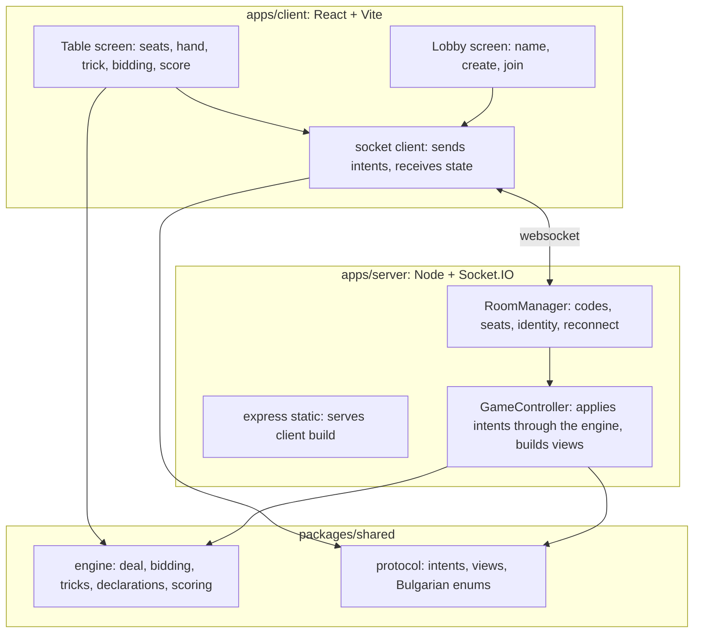
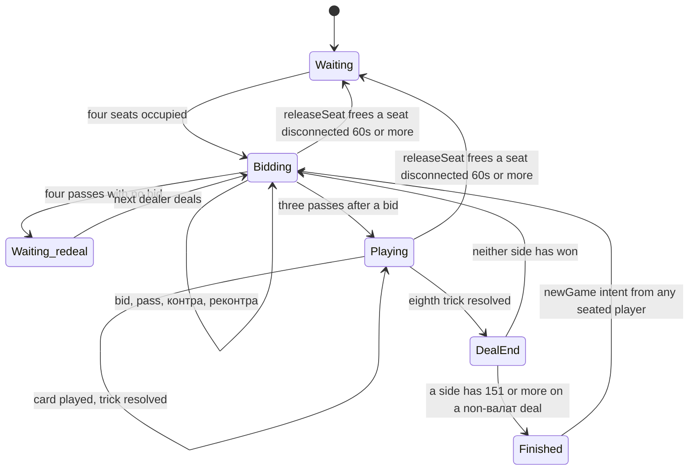
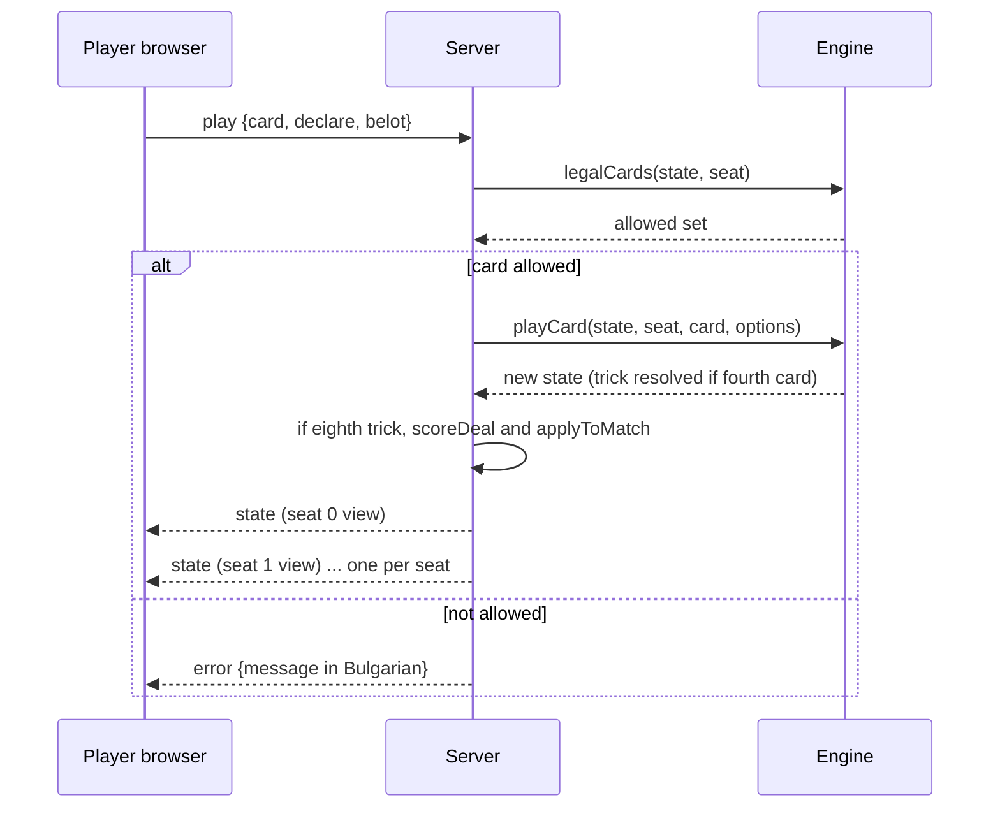

# feat: Belot online game for four friends

## Summary

Build a browser game of Bulgarian belot (белот) that four friends play together over a shared link. A player opens the site, types a nickname, creates or joins a room with a short code, and sits in one of four seats. When all four seats are taken the game starts and runs to 151 points under the full Bulgarian rules. The server owns the game state; clients only see their own hand. The UI is Bulgarian-only with a modern, minimal table layout. The whole thing deploys as one Node process on Render's free tier tonight.

## Problem Frame

There is no existing project. The request is a greenfield TypeScript app that must be playable by real people this evening, so the plan favours the smallest architecture that is still honest about the rules and cheat-proof about hidden information. Fortegames' Belot is the reference for rules and for the table flow, not for assets.

---

## Requirements

**Lobby and seating**

- R1. A player enters a nickname and either creates a room or joins one by a short code, with no account.
- R2. A room has exactly four seats; a player may sit in any empty seat and stand up again before the game starts.
- R3. The game starts automatically when all four seats are occupied.
- R4. Each player sees the table from their own seat: themselves at the bottom, partner opposite.

**Rules of play (Bulgarian belot)**

- R5. 32-card deck, two fixed partnerships (seats 0+2 vs 1+3), play and deal counter-clockwise, dealer rotates each deal.
- R6. Deal 5 cards for bidding, then 3 more after bidding, 8 per player.
- R7. Bidding starts right of the dealer with contracts in the order спатия, каро, купа, пика, без коз, всичко коз; a bid must be higher than the current one; контра is available only to the side not holding the bid and реконтра only to the bidding side after a контра; bidding ends after three consecutive passes following a bid, and four passes with no bid redeals with the next dealer.
- R8. Card order and values follow the contract: trump order J 9 A 10 K Q 8 7 (20 14 11 10 4 3 0 0), plain order A 10 K Q J 9 8 7 (11 10 4 3 2 0 0 0); всички козове uses trump order in every suit; без коз uses plain order in every suit with card points doubled.
- R9. Legal card rules: always follow suit if able. In a suit contract, when trump is led you must play a higher trump if able regardless of who is winning; when void in the led suit you must trump only if an opponent is winning the trick, and must overtrump an opponent's trump when able. In всички козове you must beat the highest card in the trick whenever able, regardless of who is winning. In без коз there is no obligation beyond following suit. The partner exemption on a trump lead is a config knob because sources disagree.
- R10. Declarations: терца 20, кварта 50, квинта or longer 100, каре of 10/Q/K/A 100, каре 9 150, каре J 200, каре 7 or 8 nothing, белот 20. Sequences and карета are declared during the first trick and revealed after it; белот is declared when playing either the K or Q of trump while still holding the other. No sequences, карета or белот in без коз; in всички козове белот counts in every suit.
- R11. Only the side holding the best sequence scores any sequences; longer beats shorter, then higher top card; an exact tie scores nothing for either side. Карета are compared the same way and separately. A card may serve either a sequence or a каре, not both.

**Scoring**

- R12. Raw points per deal are card points plus 10 for the last trick plus declarations plus a 90 валат bonus when one side wins all eight tricks.
- R13. Raw points convert to game points by dividing by ten with contract-specific rounding: a units digit at or above 6 rounds up in a suit contract, 5 in без коз, 4 in всички козове.
- R14. If the bidding side has fewer raw points than the opponents (вътре), the opponents receive the rounded total of both sides and the bidders receive nothing. Under контра the winner receives the rounded total doubled; under реконтра quadrupled.
- R15. If both sides' raw points are equal, the bidding side's rounded points hang (висящи) and go to whichever side wins the next deal; the opponents keep their own points.
- R16. The first side to reach 151 wins, except that a deal decided by валат cannot end the game; if both sides pass 151 in one deal the higher total wins and an exact tie continues.

**Client and language**

- R17. All visible text is Bulgarian: seats, bids, declarations, buttons, status lines, deal summaries.
- R18. The table shows each player's name and card count, the current trick, the current contract and bidder, the running score of both sides, and whose turn it is.
- R19. On the player's turn only legal cards are playable; illegal cards are visibly disabled.
- R20. A deal summary appears after each deal showing card points, declarations, bonuses and the rounded result for both sides.

**Connectivity**

- R21. A player who loses connection keeps their seat; the game pauses with a visible message until they reconnect from the same browser.
- R22. Server state is authoritative; a client never receives another player's hand or the undealt cards.

**Deployment**

- R23. The whole app runs as one Node process serving the built client and the WebSocket on the port the host injects.
- R24. The repository deploys to Render's free web service from a Git connection without Docker, and the README carries the exact steps.

**Match lifecycle and recovery**

- R25. After a match ends, any seated player can start a new match in the same room with the same seats; scores and hanging points reset and the dealer advances.
- R26. Joining a room whose game has already started is rejected with a Bulgarian message; the room never admits a fifth participant.
- R27. When a seat has been disconnected for at least 60 seconds, any connected seated player can free it; the room returns to waiting with that seat empty, the current deal is abandoned, and the match score is kept.
- R28. Reopening the site in the same browser returns the player to their room and seat without retyping the code; the share link carries the room code so a friend's lobby is pre-filled.

---

## Key Technical Decisions

- **TypeScript monorepo with pnpm workspaces: `packages/shared`, `apps/server`, `apps/client`.** The rules engine and the wire protocol live in `shared` so the server enforces them and the client reuses the same types and legality helpers for rendering. pnpm matches the developer's existing tooling.
- **Rules engine is pure and deterministic.** All engine functions take a state and return a new state or a result; the shuffle takes an injectable random source. This makes the scoring and legality rules unit-testable with fixed hands, which is where most of the correctness risk sits.
- **Server-authoritative game loop over Socket.IO 4.** Clients send intents (sit, bid, play), the server validates them against the engine and broadcasts a per-seat redacted view. Socket.IO's reconnection and room primitives cover the lobby without extra libraries. The client keeps the default polling-then-upgrade transport so the Render proxy is handled.
- **One `state` event carries the whole per-seat view.** Instead of many granular events, the server sends the complete view after every change. The client renders from a single object, which removes client-side state reconciliation bugs and makes reconnection trivial (the next view is the whole truth).
- **Identity is a random token in localStorage, not an account.** The token identifies the seat owner across reconnects and page reloads. It is the only credential that unlocks a seat's hidden hand, so it is minted client-side with `crypto.randomUUID()` (122 bits of entropy) and never shown in the UI. The server keeps a token-to-room index so a reconnecting socket is placed back in its room without a join intent. This satisfies "no accounts", R21 and R28 without persistence.
- **Rooms live in memory only.** Render's free instance spins down after 15 idle minutes and loses state; that matches the use case (a game night) and avoids a database. A room with no connected players for ten minutes is deleted. Because every deploy restarts the process and wipes live rooms, Render auto-deploy is switched off and fixes are deployed by hand between games.
- **Rounding thresholds and the валат bonus are engine configuration, not literals.** Research flagged the 6/5/4 rounding and the 90-point валат as the best-attested but regionally contested conventions; keeping them in one config object lets house rules change in one place.
- **Server bundled with esbuild to a single file, client built by Vite, server serves `apps/client/dist`.** Bundling inlines the workspace package from its TypeScript source so the runtime never needs workspace symlinks; only the real runtime dependencies (`express`, `socket.io`) are marked external. `--packages=external` must not be used because it would also externalize `@belot/shared`. Render runs `pnpm install` and `pnpm build`, then `node apps/server/dist/index.js`.
- **Cards are drawn with HTML and CSS, not image assets.** Rank text plus a suit glyph on a white rounded card is enough for a clean, modern look and avoids any licensing question around Fortegames' artwork.
- **Vitest for tests.** It runs TypeScript directly in a Vite monorepo with no extra config; the engine and the server room logic are the test surface, the client gets a smoke render only.

---

## High-Level Technical Design

### Components



The client imports engine helpers only for presentation (which cards are legal, how to sort a hand); every decision that matters is made on the server.

### Game state machine (per room)



A separate `paused` flag overlays Bidding and Playing whenever a seated player is disconnected; intents other than `releaseSeat` are rejected while paused and the view shows who is missing and for how long. A release abandons the current deal, keeps the match score, and the next deal starts when the seat is filled again.

### One turn, end to end



### Scoring pipeline (per deal)

Directional guidance, not implementation specification:

```text
rawPoints(side)      = cardPoints + lastTrickBonus + declarationPoints + valatBonus
compare              = rawPoints(bidders) vs rawPoints(opponents)
if bidders < opponents      -> opponents get round(rawBidders + rawOpponents), bidders 0
if bidders == opponents     -> opponents get round(rawOpponents); round(rawBidders) hangs
else                        -> each side gets round(own raw)
if контра / реконтра        -> winner gets round(total) * 2 / * 4, loser 0 (tie hangs the multiplied total)
round(x, contract)          = floor(x / 10) + (x mod 10 >= threshold[contract] ? 1 : 0)
hanging points from earlier -> added to the winner of this deal; on another tie they stay hanging and accumulate
```

---

## Output Structure

```text
Belot/
  package.json                 workspace root: build, start, test scripts
  pnpm-workspace.yaml
  render.yaml                  Render blueprint: free web service, build and start commands
  README.md                    run locally, deploy to Render, rules summary
  tsconfig.base.json
  packages/shared/
    package.json
    src/index.ts
    src/protocol.ts            intents, views, enums, Bulgarian labels map
    src/engine/cards.ts        deck, suits, ranks, order and value tables
    src/engine/deal.ts         shuffle with injectable rng, dealing
    src/engine/bidding.ts      contracts, legal bids, bidding state
    src/engine/tricks.ts       legal cards, trick winner
    src/engine/declarations.ts detection and comparison
    src/engine/scoring.ts      deal scoring, rounding, match scoring
    src/engine/config.ts       thresholds, валат bonus, target score
    src/engine/__tests__/*.test.ts
  apps/server/
    package.json
    src/index.ts               express + socket.io bootstrap, PORT, static
    src/rooms.ts               RoomManager
    src/game.ts                GameController: intents to engine to views
    src/views.ts               per-seat redaction
    src/__tests__/*.test.ts
  apps/client/
    package.json
    index.html
    vite.config.ts
    src/main.tsx
    src/App.tsx                lobby vs table routing on view state
    src/socket.ts              connection, identity token, state subscription
    src/i18n/bg.ts             every visible string
    src/components/            Lobby, Table, Seat, Hand, Card, TrickArea, BiddingPanel, ScorePanel, DealSummary, MatchEnd, PauseOverlay, ConnectionBanner, Toast
    src/styles/                tokens and layout
```

The tree is a scope declaration; the implementer may adjust names as long as the shared/server/client split holds.

---

## Implementation Units

### U1. Monorepo scaffold and build pipeline

**Goal:** A workspace where `pnpm install`, `pnpm build`, `pnpm test`, and `pnpm start` work end to end with a placeholder client and a server that serves it.

**Requirements:** R23, R24

**Dependencies:** none

**Files:** `package.json`, `pnpm-workspace.yaml`, `tsconfig.base.json`, `render.yaml`, `packages/shared/package.json`, `packages/shared/src/index.ts`, `apps/server/package.json`, `apps/server/src/index.ts`, `apps/client/package.json`, `apps/client/vite.config.ts`, `apps/client/index.html`, `apps/client/src/main.tsx`, `.gitignore`, `.nvmrc` or `engines` in the root package.

**Approach:** Three workspace packages named `@belot/shared`, `@belot/server`, `@belot/client`. Root `build` runs the shared type check, the Vite client build, then the esbuild server bundle. Root `start` runs the bundled server. The server reads `PORT` from the environment, binds `0.0.0.0`, serves `apps/client/dist` through `express.static` followed by a terminal middleware that sends `index.html` (Express 5 rejects the old `'*'` route string), and exposes `/healthz`. Pin the Node major in `engines` and the exact local pnpm in `packageManager` so Render uses the same versions that produced the lockfile. `render.yaml` declares one free web service with `pnpm install --frozen-lockfile && pnpm build`, `pnpm start`, the health check path, and `autoDeploy: false`. Vitest is configured at the root with projects for shared and server (node environment) and client (jsdom with React Testing Library). The Vite dev config proxies `/socket.io` to the server port so four local tabs can run against the dev server.

**Patterns to follow:** Standard Vite React template for the client; esbuild `--bundle --platform=node --format=cjs --external:express --external:socket.io` for the server so the shared package is inlined from source.

**Test scenarios:** Test expectation: none -- scaffolding only. Verification covers it.

**Verification:** `pnpm build` produces `apps/client/dist` and `apps/server/dist/index.js`; the bundle still starts after the `apps/server/node_modules/@belot` symlink is removed; `pnpm start` serves the placeholder page and `/healthz` returns 200 on the configured port; `pnpm test` runs with zero tests and exits 0; the scaffold is pushed and deployed to Render before U2 starts so the hosting path is proven first.

### U2. Cards, deal and bidding in the engine

**Goal:** Deck, suit and rank tables, deterministic dealing, and the complete bidding state machine.

**Requirements:** R5, R6, R7, R8

**Dependencies:** U1

**Files:** `packages/shared/src/engine/cards.ts`, `packages/shared/src/engine/deal.ts`, `packages/shared/src/engine/bidding.ts`, `packages/shared/src/engine/config.ts`, `packages/shared/src/engine/__tests__/cards.test.ts`, `packages/shared/src/engine/__tests__/bidding.test.ts`

**Approach:** Represent a card as suit plus rank with a stable string id. Provide order and point lookups keyed by contract kind (trump, plain, no-trumps doubled). Dealing produces four hands of 8 from a shuffled deck using an injected rng; the bidding phase exposes only the first 5 of each hand, the rest become visible when bidding completes. The bidding state tracks the current contract, the bidder seat, the multiplier (1, 2, 4), consecutive pass count, and whose turn it is. `legalBids(state, seat)` returns the allowed set; `applyBid` advances and reports `done`, `redeal`, or `continue`. Seat order is counter-clockwise, expressed as "next seat" being `(seat + 1) mod 4` with the table rendered accordingly on the client.

**Execution note:** Implement the engine test-first; fixed hands make every rule a table-driven test.

**Patterns to follow:** Pure functions, no classes holding mutable state.

**Test scenarios:**
- Deck has 32 unique cards; dealing with a seeded rng gives four disjoint hands of 8 and is reproducible for the same seed.
- Trump order and values match R8 for every rank; plain order and values match R8; без коз values are doubled and всички козове uses trump values in every suit.
- The seat right of the dealer bids first and bidding proceeds counter-clockwise.
- Only strictly higher contracts are legal; a partner may raise their own side's bid.
- Контра is legal only for the side not holding the bid and only when a contract exists; реконтра only for the bidding side after a контра; neither is legal after itself.
- A higher contract after контра resets the multiplier to 1.
- Three passes after a bid end bidding with the last contract and bidder recorded; four passes with no bid return `redeal`.
- After bidding completes each hand exposes all 8 cards.

**Verification:** All bidding tests pass; the state object serialises to JSON without loss.

### U3. Trick play legality and resolution

**Goal:** `legalCards` and `playCard` that enforce R9 exactly and resolve trick winners for every contract kind.

**Requirements:** R8, R9

**Dependencies:** U2

**Files:** `packages/shared/src/engine/tricks.ts`, `packages/shared/src/engine/__tests__/tricks.test.ts`

**Approach:** A trick holds the leader, up to four plays, and the current winner computed from contract-aware comparison. `legalCards(hand, trick, contract)` implements the three obligation regimes: suit contract with the partner-is-winning exemption, всички козове with the always-beat rule, без коз with follow-suit only. `playCard` appends, resolves on the fourth card, sets the next leader to the winner, and records won cards per side. After the eighth trick the last-trick bonus is attributed.

**Execution note:** Test-first with fixed hands.

**Patterns to follow:** Same pure style as U2.

**Test scenarios:**
- Void in led suit, opponent winning, holding a trump: only trumps are legal.
- Void in led suit, partner winning, holding a trump: any card is legal.
- Opponent already trumped, holding a higher trump: only higher trumps are legal; holding only lower trumps: any card is legal.
- Всички козове: led suit held with a card that beats the current best: only beating cards are legal, even when the partner is winning; no beating card held: any card of the led suit is legal.
- Без коз: led suit held: any card of that suit is legal; void: any card.
- Trump led in a suit contract: must play a higher trump if able, including when the partner led it and is winning; with the config knob flipped the partner exemption applies.
- Trick winner: highest trump beats any plain card; among plain cards the highest of the led suit wins; in без коз the highest of the led suit wins.
- Fourth card resolves the trick, the winner leads next, the won cards are added to the winner's side.
- Eighth trick adds the last-trick bonus to its winner's side.

**Verification:** Tests pass; a scripted full deal of 32 plays ends with every card assigned to exactly one side.

### U4. Declarations

**Goal:** Detect sequences, карета and белот in a hand, and compare declarations between sides under R10 and R11.

**Requirements:** R10, R11

**Dependencies:** U2

**Files:** `packages/shared/src/engine/declarations.ts`, `packages/shared/src/engine/__tests__/declarations.test.ts`

**Approach:** Detection runs on the full 8-card hand at the start of trick one and returns candidate sequences (by suit, in plain 7 to A order) and карета with their values. When a card would belong to both a sequence and a каре, choose the assignment with the higher total value. Белот detection runs at play time: the played card is the K or Q of the relevant suit and the partner card is still in hand. Comparison takes both sides' announced sets and returns which side scores sequences, which scores карета, and the point totals. In без коз detection returns nothing. In всички козове every suit qualifies for белот.

**Execution note:** Test-first.

**Test scenarios:**
- Hand with 7 8 9 of one suit yields a терца worth 20; 10 J Q K yields a кварта 50; five in a row yields 100; six in a row still yields 100 as one declaration.
- Two separate sequences in different suits are both returned.
- Four jacks yield 200, four nines 150, four aces 100, four eights nothing.
- Cards shared between a possible каре and a sequence resolve to the higher-value assignment.
- Side A has a кварта and side B a терца: only A's sequences count, including a second терца A holds.
- Equal length: higher top card wins; identical length and top card: neither side scores sequences.
- Карета compare independently from sequences: B can win карета while A wins sequences.
- Без коз: detection returns no sequences, no карета, and белот is never offered.
- Белот is offered when playing K of trump while holding Q of trump, and when playing Q while holding K; not offered when the partner card was already played; in всички козове offered in any suit.

**Verification:** Tests pass; detection over all 32 cards in any 8-card subset never throws.

### U5. Deal scoring and match scoring

**Goal:** Convert a finished deal into game points under R12 to R16, apply hanging points and валат, and detect the end of the match.

**Requirements:** R12, R13, R14, R15, R16

**Dependencies:** U3, U4

**Files:** `packages/shared/src/engine/scoring.ts`, `packages/shared/src/engine/config.ts`, `packages/shared/src/engine/__tests__/scoring.test.ts`

**Approach:** `scoreDeal(dealResult, config)` builds a breakdown per side (card points, last trick, declarations, валат, raw total, rounded), then applies the bidder comparison, the multiplier, and the hanging rule from the pipeline in High-Level Technical Design. `applyDealToMatch(match, dealScore)` adds points, moves hanging points, and decides `continue` or `finished` while refusing to finish on a валат deal. The breakdown is part of the deal summary sent to clients.

**Execution note:** Test-first with worked examples from the Acceptance Examples section.

**Test scenarios:**
- Rounding: suit contract 86 and 76 round to 9 and 8; 85 rounds to 8; всички козове 124 rounds to 13 and 123 to 12; без коз 135 rounds to 14 and 134 to 13.
- Bidders win a suit deal 100 to 62: bidders get 10, opponents 6.
- Bidders lose 70 to 92: opponents get 16, bidders 0.
- Tie 81 to 81 with the bidders having declared nothing: opponents get 8, 8 hang; next deal's winner receives the 8 on top of their points.
- Контра, bidders win 100 to 62: bidders get 32, opponents 0. Реконтра: 64.
- Контра with a tie: the doubled total hangs.
- Валат by the bidders: their raw includes 90 plus the last trick; the deal cannot finish the match even at 160 points; the following non-валат deal can.
- Declarations count toward the bidder comparison: bidders 80 in cards plus 20 терца beat opponents at 82.
- Both sides cross 151 in one deal: the higher total wins; equal totals continue.
- Hanging points are cleared once awarded.
- Two consecutive ties accumulate the hanging points; the next decided deal awards the whole accumulated amount to its winner.

**Verification:** Tests pass; every branch of the pipeline has at least one example.

### U6. Server rooms, seats, identity and reconnection

**Goal:** A Socket.IO server where players create or join rooms by code, sit and stand, are identified by a browser token, and reclaim their seat after a disconnect.

**Requirements:** R1, R2, R3, R21, R22, R26, R27, R28

**Dependencies:** U1

**Files:** `apps/server/src/index.ts`, `apps/server/src/rooms.ts`, `packages/shared/src/protocol.ts` (created here: intents, view types, enums, Bulgarian error and label maps; U7 extends the view types), `apps/server/src/__tests__/rooms.test.ts`

**Approach:** The client sends its identity token and nickname on connect. `RoomManager` keeps a map of room code to room and a token-to-room index. A room holds four seats (player id, nickname, connected flag, disconnected-since timestamp), the sockets of players who joined but have not sat down while the room is waiting, and the game controller once started. Room codes are four uppercase letters without ambiguous glyphs. Intents: create, join, sit, stand, releaseSeat. Sitting in an occupied seat or standing during a game is rejected with a Bulgarian error. Joining a room whose game has started is rejected with "Играта вече започна" unless the token already owns a seat there. On connect, a token found in the index is placed straight back into its room and seat and receives the full view. On disconnect the seat stays owned and `connected` flips false. `releaseSeat` from a connected seated player frees a seat that has been disconnected for at least 60 seconds and hands the room back to the controller as waiting. Failed join attempts are limited per socket (ten per minute) so codes cannot be enumerated quickly. A room with no connected sockets for ten minutes is removed. All Bulgarian error strings live in one map in the protocol module so client and server share them.

**Patterns to follow:** Socket.IO rooms keyed by room code for lobby-level events only; per-seat views are emitted to each seat's socket individually, never broadcast to the room. One handler module per intent family.

**Test scenarios:**
- Creating a room returns a code and seats the creator in no seat until they choose one.
- Joining an unknown code returns an error; joining a known code adds the player as unseated.
- Two players cannot occupy the same seat; the second attempt is rejected and the first stays.
- Standing up before the game returns the seat to empty; standing up during a game is rejected.
- The fourth sit-down marks the room as started and invokes the game-start hook (stub controller).
- Joining a started room with a new token is rejected; joining with a token that owns a seat there succeeds.
- Disconnecting a seated player marks the seat disconnected and keeps the nickname; reconnecting with the same token restores it; a different token cannot take that seat.
- A new socket presenting a token that owns a seat in a live room lands back in that room and seat without a join intent.
- `releaseSeat` is rejected while the seat has been gone under 60 seconds and succeeds after (fake timers); the freed seat can be taken by a new token.
- The eleventh failed join within a minute from one socket is rejected regardless of the code.
- A room with no connected players is removed after the idle window (use fake timers).

**Verification:** Tests pass; two browser tabs can create and join a room locally and see each other sit; reloading a tab returns it to the same seat.

### U7. Game controller and per-seat views

**Goal:** Drive a room's game through the engine from bidding to match end, pausing on disconnect, and produce the redacted view each seat receives.

**Requirements:** R3, R4, R6, R7, R9, R10, R15, R16, R18, R20, R21, R22, R25, R27

**Dependencies:** U2, U3, U4, U5, U6

**Files:** `apps/server/src/game.ts`, `apps/server/src/views.ts`, `packages/shared/src/protocol.ts` (extend the view types only), `apps/server/src/__tests__/game.test.ts`, `apps/server/src/__tests__/views.test.ts`

**Approach:** `GameController` owns the match state (scores, hanging points, dealer seat) and the current deal state (phase, bidding, hands, tricks, declarations). Intents: `bid`, `play` with optional `declare` and `belot` flags, `newGame` accepted from any seated player while the phase is `finished`. Every intent is validated by seat ownership, turn, pause flag, and the engine's legal set; on success the controller applies it, runs phase transitions (bidding done, deal scored, match finished, redeal), and broadcasts. After a deal ends the controller holds a `dealEnd` phase with the breakdown for a fixed pause before dealing again. `newGame` resets scores and hanging points, advances the dealer and deals. When the room manager frees a seat, the controller abandons the current deal, keeps the match score, and waits; when the seat is filled again it deals with the same dealer. `buildView(room, seat)` returns: seats with names, connection and card counts, own hand sorted for display, own legal cards when it is the player's turn, the current trick, the last completed trick briefly, bidding history, contract and multiplier, both sides' scores and hanging points, declarations revealed after trick one, the deal breakdown during `dealEnd`, and the pause status. Declarations offered to a player are computed by the server and included in the view so the client only shows a button.

**Execution note:** Drive tests through intents against a seeded deal so the whole flow is deterministic.

**Test scenarios:**
- Four seated players receive views in the bidding phase with five cards each and the correct first bidder.
- A bid from a player whose turn it is not is rejected with an error; the state is unchanged.
- Three passes after a bid move the phase to playing, reveal eight cards, and set the leader right of the dealer.
- Four passes redeal with the dealer advanced.
- Playing an illegal card is rejected; a legal card advances the trick; the fourth card resolves it and the winner leads.
- Declaring on the first trick records the declaration; declaring on the second trick is rejected; the revealed declarations appear in every seat's view after trick one.
- Белот flag on a qualifying card adds 20 to the side; on a non-qualifying card it is rejected.
- After the eighth trick the phase is `dealEnd`, the breakdown matches the engine, and after the pause a new deal starts with the next dealer.
- A deal that reaches 151 on a non-валат deal moves to `finished` with the winner named; a валат deal at 151 continues.
- Disconnecting a seated player sets paused and rejects intents; reconnecting resumes with the same state.
- `newGame` from a seated player in `finished` resets both scores and hanging points, advances the dealer and starts bidding; `newGame` in any other phase is rejected.
- Freeing a seat mid-deal abandons the deal, keeps the scores, and the next sit-down starts a new deal with the same dealer.
- No view ever includes another seat's hand; hand counts are correct for every seat.
- A view for a seat that is disconnected includes the seconds since the disconnect so the client can show the release countdown.

**Verification:** Tests pass; a scripted four-client run completes a full match locally.

### U8. Client: lobby and table in Bulgarian with a modern minimal design

**Goal:** The complete React UI: lobby, seat selection, bidding panel, hand and trick area, score panel, declarations, deal summary, pause overlay, all in Bulgarian.

**Requirements:** R1, R2, R4, R17, R18, R19, R20, R21, R25, R27, R28

**Dependencies:** U7

**Files:** `apps/client/src/App.tsx`, `apps/client/src/socket.ts`, `apps/client/src/i18n/bg.ts`, `apps/client/src/components/Lobby.tsx`, `apps/client/src/components/Table.tsx`, `apps/client/src/components/Seat.tsx`, `apps/client/src/components/Hand.tsx`, `apps/client/src/components/Card.tsx`, `apps/client/src/components/TrickArea.tsx`, `apps/client/src/components/BiddingPanel.tsx`, `apps/client/src/components/ScorePanel.tsx`, `apps/client/src/components/DealSummary.tsx`, `apps/client/src/components/MatchEnd.tsx`, `apps/client/src/components/PauseOverlay.tsx`, `apps/client/src/components/ConnectionBanner.tsx`, `apps/client/src/components/Toast.tsx`, `apps/client/src/styles/tokens.css`, `apps/client/src/styles/table.css`, `apps/client/src/__tests__/App.test.tsx`

**Approach:** The socket module creates or reads the identity token in localStorage, connects, and exposes the connection status, the latest view, the last error and `send(intent)` through a small hook. The app has three top-level states: Свързване... until the first connection or view arrives (this covers Render's cold start), Lobby when there is no room, Table otherwise. The lobby reads a room code from the URL (`/r/ABCD`, also written into the share link shown in the room) and pre-fills it; if the server reports that the token's room no longer exists the app falls back to the lobby. The table is a centered rounded felt area on a dark neutral background: the player's seat at the bottom, partner at the top, opponents left and right, computed by rotating seat indices so the view is always from the player's chair. Cards are white rounded rectangles with rank and a suit glyph in red or near-black, fanned in the hand with a muted state when not legal. Card interaction is two taps on every device: the first tap lifts and selects the card and reveals the Белот toggle when that card qualifies, the second tap on the same card sends the play intent; tapping another card moves the selection. Cards keep a minimum 44 px touch target at phone width. The bidding panel shows the six contracts as buttons in order plus Пас, Контра, Реконтра, enabled from the view's legal bids. The trick area shows the four plays positioned by seat. The score panel shows Ние / Те, the contract, multiplier, and hanging points. On trick one an Анонс button appears when the view offers declarations. The deal summary is a modal-like card with the breakdown and a countdown. MatchEnd shows the final score, the winning side and a Нова игра button that sends `newGame`. The pause overlay names the missing player, shows how long they have been gone, and after 60 seconds offers Освободи мястото, which sends `releaseSeat`. The connection banner shows Връзката е прекъсната, свързване отново... from the socket's own disconnect event, independent of the server view. The toast shows server error messages for a few seconds. Typography uses a single system-ui or Inter stack; the design tokens file holds the palette (felt green-teal, off-white cards, one accent for the active turn).

**Patterns to follow:** Functional components with hooks, no global state library; all strings imported from the i18n module; CSS modules or plain CSS with tokens.

**Test scenarios:**
- App shows the connecting state before the socket connects and the lobby with Bulgarian labels once connected with no room.
- Opening `/r/ABCD` pre-fills the join code in the lobby.
- Given a waiting-room view the table shows four seats with Седни buttons on empty seats and the player's own seat at the bottom.
- Given a bidding view where it is the player's turn only the legal bid buttons are enabled.
- Given a playing view only legal cards are selectable; the first tap selects, the second tap on the same card sends a play intent with that card id and the current Белот toggle value.
- Given a playing view where the selected card qualifies for белот the toggle is shown; for other cards it is hidden.
- Given a finished view MatchEnd shows the winner and Нова игра sends `newGame`.
- Given a paused view the overlay names the missing player; after 60 seconds the release button appears and sends `releaseSeat`.
- When the socket reports a disconnect the banner appears while the last view stays on screen.
- A server error event renders as a toast with the Bulgarian message.

**Verification:** Tests pass; opening four browser tabs locally runs a whole deal with correct rotation per tab, and the layout holds at phone width and at desktop width without horizontal scroll.

### U9. Deployment to Render and README

**Goal:** The repository deploys to Render's free tier from GitHub and the README carries the steps so the game is shareable tonight.

**Requirements:** R23, R24

**Dependencies:** U1, U7, U8

**Files:** `README.md`, `render.yaml` (finalize: health check path, `autoDeploy: false`), `apps/server/src/index.ts` (production hardening only)

**Approach:** Confirm the server binds `0.0.0.0:$PORT`, serves the client build and the Socket.IO endpoint on one origin so no CORS config is needed, and answers `/healthz`. Finalize `render.yaml` from U1 with the health check path and auto-deploy off. The README documents local run, GitHub push, "New Web Service" connection in Render, the free plan choice, the 15-minute spin-down and 30 to 60 second cold start, that every manual deploy restarts the server and drops live rooms, and how to share the room link. Add a short Bulgarian rules summary and the house-rule config knobs.

**Test scenarios:** Test expectation: none -- configuration and documentation; verification is the live deploy.

**Verification:** A pushed commit builds green on Render; the public URL loads the lobby; two browsers on different networks join the same room and see each other; a full deal plays over the deployed WebSocket.

---

## Delivery Order

The units are ordered by dependency, but the evening has a cut line. Deploy the U1 scaffold to Render first so hosting problems surface in the first minutes, not the last. The first playable build is U1, U2, U3, U5 with declarations treated as zero, U6, U7, U8 and U9. If time runs short, U4 and the declaration paths in U7 and U8 (Анонс button, Белот toggle, declaration lines in the summary) are the cut: the game is fully playable without them and they layer on afterwards without changing the protocol shape. Контра, реконтра, висящи and the валат exception stay in the first build because they are a few lines of scoring each and friends will expect them.

---

## Acceptance Examples

- AE1. Suit contract, bidders win
  - **Given:** contract купа, bidders hold 86 raw points, opponents 76, no declarations.
  - **Then:** bidders score 9, opponents score 8.
- AE2. Bidders fall inside
  - **Given:** contract пика, bidders 70 raw, opponents 92 raw.
  - **Then:** opponents score 16, bidders 0.
- AE3. Hanging points
  - **Given:** contract каро, both sides 81 raw.
  - **Then:** opponents score 8, 8 points hang; the side that wins the next deal receives them.
- AE4. Контра
  - **Given:** контра on спатия, bidders 100 raw, opponents 62 raw.
  - **Then:** bidders score 32, opponents 0.
- AE5. Валат cannot end the match
  - **Given:** bidders at 145 win all eight tricks in всички козове.
  - **Then:** bidders score the rounded total including the 90 bonus, exceed 151, and the match continues to another deal.
- AE6. Obligation to trump only against an opponent
  - **Given:** suit contract, player is void in the led suit, partner currently wins the trick, player holds trumps.
  - **Then:** every card in the player's hand is legal.
- AE7. Всички козове always beat
  - **Given:** всички козове, partner leads the 9 of купа and wins so far, player holds J and 7 of купа.
  - **Then:** only the J is legal.
- AE8. Reconnect
  - **Given:** a seated player closes the tab mid-deal.
  - **Then:** the other three see a pause message naming them; reopening the link restores their seat, hand and turn.

---

## Scope Boundaries

**Non-goals for this version**

- Bots or AI players; a table waits for four humans.
- Accounts, rankings, match history, or any database.
- Chat, emotes, sound, animations beyond simple transitions.
- Spectators watching a running game.
- Languages other than Bulgarian.
- Per-turn timers and auto-play on timeout.

**Deferred to follow-up work**

- Turn timers with auto-pass and auto-play, mirroring Fortegames.
- Standing up mid-game with a replacement player or a bot filling the seat.
- Persisting rooms across server restarts so a Render spin-down does not lose a game.
- Sound and richer card animations.

---

## Risks and Dependencies

- **Rule variant disputes.** Rounding thresholds (6/5/4) and the валат bonus are regionally contested; both live in the engine config so a house rule is a one-line change. The README states the conventions used.
- **Render free-tier spin-down.** After 15 idle minutes the process stops and rooms are lost; the first visitor waits up to a minute. Acceptable for a game night; documented in the README.
- **pnpm on Render.** Render selects pnpm when a `pnpm-lock.yaml` is present; if the build image lacks it, the build command can enable it through corepack. Verified during U9.
- **No Docker locally.** Nothing in the plan depends on Docker; the deploy path is Git connect with build and start commands.
- **Belot timing convention.** Sources disagree on whether белот is declared on the first or second of the pair; the plan uses "either card while still holding the other", the best-attested rule.
- **Deploys during play.** A push to Render restarts the process and every live room is lost. Auto-deploy is off and the README says to deploy between games; the client returns to the lobby when its room is gone.
- **Hidden information has one line of defence.** All eight cards are dealt up front and hidden only by the per-seat view builder; the U7 redaction tests are the guard, so they must cover every field of the view.

---

## Sources and Research

- Fortegames Belot rules page, `forte.games/ngames.php?gt=B`: contract order, 151 target, declarations table.
- belot.bg rules (Bulgarian and English): deal direction, bidding, вътре, висящи, контра and реконтра mechanics, валат and the no-win-on-валат rule, the всички козове always-beat rule.
- denislavsotirov.blogspot.com belot scoring post: the 6/5/4 rounding thresholds with worked examples.
- honorofwriting.blogspot.com belot rules: trump obligation applies only against an opponent; белот declared on either card.
- blog.bozho.net/blog/913: regional variation discussion that motivated the config-driven thresholds.
- Render free tier docs and changelog: no card, WebSocket traffic keeps the service active, 15-minute spin-down, `PORT` injection, Git-connect deploy.
- Socket.IO 4.x is current; a single instance needs no adapter or sticky sessions; keep polling-then-upgrade transport.
